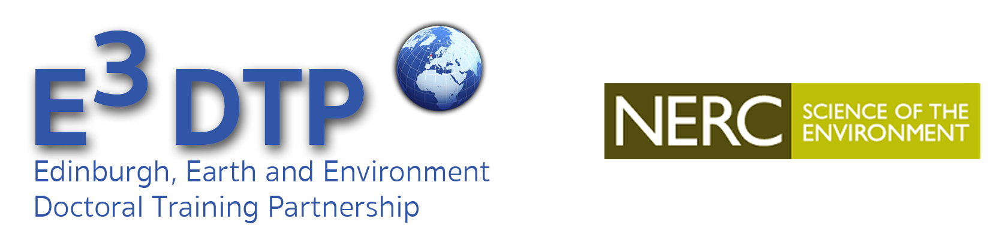

.. MNDM tutorials documentation master file, created by
   sphinx-quickstart on Mon Dec 15 15:59:09 2014.
   You can adapt this file completely to your liking, but it should at least
   contain the root `toctree` directive.

   

Welcome to University of Edinburgh's Modelling, Numeracy and Data Managment (NMDM) Course
==========================================================================================

A course offered through the E3 Doctoral Trainaing Partnership, funded through the Natural Environment Research Council. 

Welcome to Numeracy, Modelling and Data Management (NMDM). 
This course is intended to give you an overview of a number of tools that researchers can use to do research. 
We will sacrifice depth for breath: you can think of this course as showing you tools that could be ueful for your research so that you can go to speacialised courses or use web resources in the futire if you want to deepen your understanding. 

Introductory video
-----------------------

  `Click here for a brief introduction to the course <http://www.geos.ed.ac.uk/~smudd/export_data/EMDM_videos/DTP_NMDMcourse_video_001_intro.mp4>`_.

Schedule of the Course
============================

  #. Prior to week 1 tutorial: 
      
      * Read the section :ref:`background-head` and the recommended reading therein.
      * Go through the videos in the section :ref:`getting-on-servers`.
      * Go through the videos in the section :ref:`simple-shell`.
      * Make sure you can open a terminal window in our servers, and navigate around files and folders.  
  
  #. Prior to week 2 tutorial:
  
      

Authors
=============

This website is built by:

  * `Simon M. Mudd <http://www.geos.ed.ac.uk/homes/smudd/>`_; School of GeoSciences, University of Edinburgh. 

Contents:
==================

.. toctree::
   :maxdepth: 3
   :numbered:

   Background and motivation <background_and_motivation>
   Getting onto University of Edinburgh servers <getting_onto_servers>
   Setting up a virtual linux machine for work outside of the Edinburgh network <outside_edin>
   Simple commands in a shell <simple_shell>
   Version control with git <version_control_git>

Indices and tables
==================

* :ref:`search`

